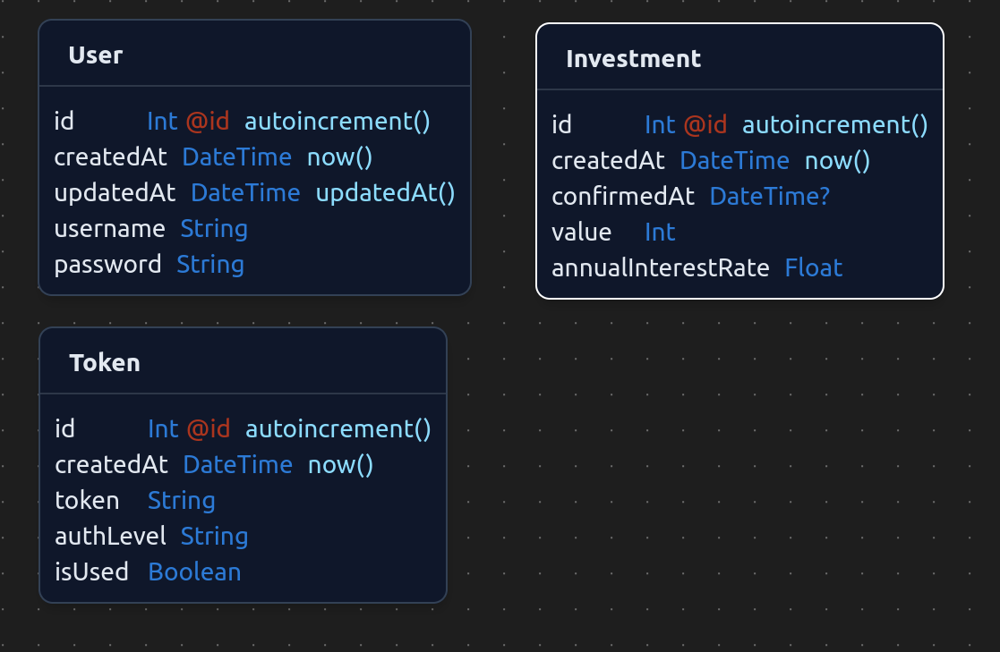
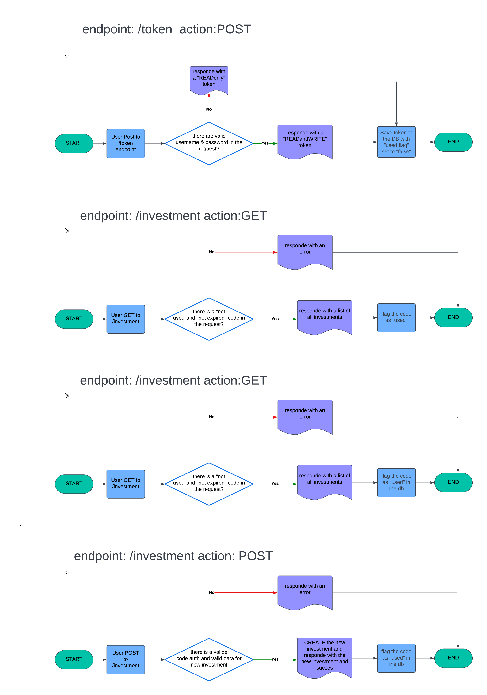

<p align="center">
  
</p>
<p align="center">
    <h1 align="center">investmentAPI</h1>
</p>
<p align="center">
    <em>Claudio Dall'Ara</em>
</p>
<p align="center">
	
	
	
	
<p>
<p align="center">
		<em>Developed with the software and tools below.</em>
</p>
<p align="center">
	
	
	
	
	
	<br>
	
	
	
	
</p>
<hr>

## 🔗 Quick Links

> - [📍 Overview](#-overview)
> - [📦 Features](#-features)
> - [📂 Repository Structure](#-repository-structure)
> - [🚀 Getting Started](#-getting-started)
>   - [⚙️ Installation](#️-installation)
>   - [🤖 Running investmentAPI](#-running-investmentAPI)
> - [📉 DataBase Design](#-database-design)
> - [🔐 Authentication Flow](#-authentication-flow)
> - [🔥 API](#-api)
> - [🧪 Tests](#-tests)
> - [🛠 Project Roadmap](#-project-roadmap)
> - [🤝 Contributing](#-contributing)
> - [📄 License](#-license)
> - [📧 Contact](#-license)

---

## 📍 Overview

**Exercise Specifications:**

A company has decided to allow frontend-enabling bees to the public
developers to experiment with those already made bees. Bees will allow you to create and
read about investments and an API that allows you to see how many and which ones over time
investments have been made. However, before carrying out some operations they must be
authorizations via a specific API, which will assign two levels of access based on the request

**Technical specifications:**

1. Create an API that returns a unique, one-time use code
   which provides access to the rest of the bees with two permission levels, one for
   reading and one for reading and writing. If the request is made a basic
   permission to grant that reading and writing otherwise only in
   reading
2. Creation of investments
3. Reading investments
4. Investment statistics API, which allows you to filter between two periods to see the
   number or value of investments made in the selected period. Furthermore
   this api will have to be used for graphs, consequently the values
   they can be divided by day, week, month and year

**Investment Specifications:** {
data creation,
confirmation of data,
value,
annual rate,
id
}

**Delivery specifications:**
The code must be delivered via a public repository on github, with the
specifications to start in code.
It is advisable to leave Postman (or similar) files in the repository for API testing

**Implementation Requests:**

- Backend development must be implemented with Node.js and a framework
  choice(Express favorite)
- The use of Typescript is mandatory
- Data can be saved in a SQL db or in a file
- Carry out e2e tests to verify the correct functioning of the developed APIs
  (with bookcase of your choice)

**Evaluation methods:**
The project will be evaluated based on:

- Code quality and reusability
- Compliance with requirements
- Following best practices
- Correct use of git

---

## 📦 Features

### Investment Management

- **Creation:** Allows the creation of new investments by specifying value and annual interest rate.
- **Reading:** Enables viewing all investments, a single investment, or aggregate statistics over a defined period.
- **Update:** Allows modification of an existing investment's details (value, interest rate, confirmation date).
- **Deletion:** Enables the removal of an investment.

### Authentication

- **JWT Token:** Uses JWT tokens to authenticate users and secure resources. The token is unique and can be used only once.
- **User Roles:** Supports different user roles : read, readWrite for athl level permission.

### Statistics

- **Data Analysis:** Provides features to analyze investment data, such as performance over time .
- **Customization:** Allows users to customize statistics according to their needs, including selecting the relevant period and choosing the granularity between day, week, month, and year.

### Other Features

- **Health Check:** Monitors the server's health status.
- **API Documentation:** Provides detailed documentation of the APIs.

---

## 📂 Repository Structure

```sh
└── investmentAPI/
    ├── README.md
    ├── combined.log
    ├── doc
    │   ├── authflow
    │   │   └── auth-flowcahrt.pdf
    │   ├── original_track
    │   │   └── Esercizio_1_be.pdf
    │   └── test
    │       ├── insomnia_v4
    │       │   └── Insomnia_2024-07-22.json
    │       └── postman_v2
    │           └── InvestmentAPI.postman_collection.json
    ├── jest.config.ts
    ├── note.md
    ├── package-lock.json
    ├── package.json
    ├── prisma
    │   ├── dev.db
    │   ├── schema.prisma
    │   ├── seed.ts
    │   ├── seedData
    │   │   └── investmentSeedData.ts
    │   ├── test.db
    │   └── tsconfig.json
    ├── src
    │   ├── app.ts
    │   ├── controllers
    │   │   ├── errorController.ts
    │   │   ├── investmentController.ts
    │   │   └── tokenController.ts
    │   ├── midllewares
    │   │   └── authMiddleware.ts
    │   ├── routes
    │   │   ├── healthRouter.ts
    │   │   ├── helpRouter.ts
    │   │   ├── investmentRouter.ts
    │   │   └── tokenRouter.ts
    │   ├── server.ts
    │   ├── service
    │   │   ├── investmentService.ts
    │   │   └── tokenService.ts
    │   ├── test
    │   │   ├── healthRouter
    │   │   │   └── health.test.ts
    │   │   ├── investmentRouter
    │   │   │   ├── createInvestment.test.ts
    │   │   │   ├── deleteInvestment.test.ts
    │   │   │   ├── getOneInvestment.test.ts
    │   │   │   ├── getallInvestments.test.ts
    │   │   │   ├── statsInvestment.test.ts
    │   │   │   └── updateInvestment.test.ts
    │   │   ├── setupTest.ts
    │   │   ├── tokenRouter
    │   │   │   └── tokenRouter.test.ts
    │   │   └── utils
    │   │       └── deleteExpiredTokens.test.ts
    │   ├── types
    │   │   ├── TInvestment.ts
    │   │   └── TUser.ts
    │   └── utils
    │       ├── appError.ts
    │       ├── catchAsync.ts
    │       ├── cleanupService.ts
    │       ├── cookieUtils.ts
    │       ├── dateUtils.ts
    │       ├── dbServer.ts
    │       ├── jwtConfig.ts
    │       └── logger.ts
    └── tsconfig.json
```

---

## 🚀 Getting Started

**_Requirements_**

Ensure you have the following dependencies installed on your system:

- **TypeScript**: `version x.y.z`

### ⚙️ Installation

### Prerequisites

You need to have Node.js (>= 22.2.0) installed locally .
Useful links:

- Node.js: https://nodejs.org/en/download/package-manager

### Main Installation

1. Clone the investmentAPI repository:

```sh
git clone https://github.com/boobaGreen/investmentAPI
```

2. Change to the project directory:

```sh
cd investmentAPI
```

3. Important: For the project to function properly, both environment files for development and testing are required.
   Rename the files .env.example and env.test.example to .env and .env.test, respectively, and adjust the variables contained within as needed. You can leave them as they are for an initial test.

4. Install the dependencies:

```sh
npm install
```

5. Create the .env files. For the project, we plan to create 2 databases, one for 'dev' and one for 'test'. To keep the two environments separate, I have prepared scripts to facilitate their creation and initial seeding.
   he main environment file is called .env, while the one for testing is .env.test. I have provided two example files for reference: .env.example and .env.test.example

6. Now let's create the 2 databases with this commands :

```sh
npm run dbdev:push
```

```sh
npm run dbtest:push
```

7. Populate them with sample records if necessary using seed data :

```sh
npm run dbdev:seed
```

```sh
npm run dbtest:seed
```

### 🤖 Running investmentAPI

#### Local Run

Use the following command to run investmentAPI with nodeman:

```sh
npm run dev
```

#### Deploy - for Production

Use the following command to build:

```sh
npm run build
```

Use the following command to run:

```sh
npm start
```

---

## 📉 DataBase Design

The project includes three tables in the database: User, Token, and Investment. The details of these tables are illustrated in the image below.



---

## 🔐 Authentication Flow

The application supports two levels of authorization:

1. **JWT Token Generation**

   - **Endpoint**: POST `/api/token`
   - **Credentials**: Basic authentication (username and password)
   - **Response**:
     - A JWT with an expiration time
       - Configurable via the environment variable `JWT_HOUR_EXPIRATION`
       - Expiration time in hours (minimum 1 hour, maximum 24 hours, only integer values are allowed)
       - Defaults to 1 hour for invalid formats and 24 hours if the value exceeds the maximum limit

2. **Token Types**

   - **Read-Write Token**
     - Obtained with correct credentials (username and password)
   - **Read-Only Token**
     - Issued when the POST request body is empty

3. **Error Handling**

   - **Incorrect or Partial Credentials**: An error is returned

4. **Token Requirements**

   - Tokens must be unique and valid for a single use
   - Ensured by:
     - Generating the JWT with a secret key
     - Including a unique username and creation date in the payload

5. **Single-Use Token Enforcement**
   - Upon token issuance:
     - The token is sent back as a JWT cookie
     - Recorded in a database with a `used` field set to `false`
   - Upon token usage:
     - The `used` field is flagged as `true`
     - Subsequent requests with the same JWT will result in an error

For a visual representation of the authentication flow, refer to the diagram below:



### 🗑️ Token Cleanup

To manage expired JWTs efficiently, a cleanup function utilizing cron jobs is implemented. This function periodically executes to:

- **Check Expiration**: Verify which JWTs recorded in the `Token` table have expired based on their expiration time.
- **Remove Invalid Tokens**: Delete tokens that are no longer valid due to expiration, enhancing scalability and maintaining a clean dataset.

Initially, the cron job was set to run hourly. However, for optimization, it has been configured to execute based on the `JWT_HOUR_EXPIRATION` environment variable, aligning the cleanup frequency with the JWT expiration settings.

## 🔥 API

### Health Check

- **Method:** GET
- **Path:** `/`
- **Description:** Provides a basic health check to confirm that the server is operational. This endpoint returns a JSON object indicating the server's status and ensures that the server is up and running correctly.
- **Authentication:** Not required
- **Response:**
  - **Status:** 200 OK
  - **Body:**
    ```json
    {
      "status": "success",
      "message": "Server is healthy"
    }
    ```
  - **Fields:**
    - `status`: Indicates the success status of the health check.
    - `message`: A message confirming that the server is operational.
- **Notes:**
  - This endpoint is useful for monitoring and checking the server's availability.
  - It does not require any request parameters or authentication.

### API Documentation

- **Method:** GET
- **Path:** `/api`
- **Description:** Provides a comprehensive list of all available API endpoints and their descriptions. This endpoint serves as a reference for developers to understand how to interact with the API.
- **Authentication:** Not required
- **Response:**
  - **Status:** 200 OK
  - **Body:**
    ```json
    {
      "status": "success",
      "message": "List of all available API endpoints",
      "endpoints": [
        {
          "method": "GET",
          "path": "/api",
          "description": "Provides a list of all available API endpoints and their descriptions."
        },
        {
          "method": "GET",
          "path": "/api/health",
          "description": "Health check endpoint to verify that the server is operational."
        },
        {
          "method": "POST",
          "path": "/api/token",
          "description": "Generates a JWT token. Requires a POST request with \"username\" and \"password\". On success, returns an HTTP-only JWT cookie with \"readWrite\" permissions. If the credentials are incorrect or missing, a generic 400 error is returned. If the payload is empty, a single-use JWT token with \"read\" permissions is issued."
        },
        {
          "method": "POST",
          "path": "/api/investment",
          "description": "Creates a new investment record. Requires a single-use JWT token with \"readWrite\" permissions in the cookie. The request body must include \"value\" (integer) and \"annualInterestRate\" (float). If required fields are missing or the JWT token lacks appropriate permissions, a generic 400 error will be returned. On successful creation, a 201 status is returned along with the newly created investment object. If the token has only \"read\" permissions, a 400 error is returned, and if required fields are missing from the request body, a 400 error is also returned."
        },
        {
          "method": "GET",
          "path": "/api/investment",
          "description": "Retrieves a list of all investments. Requires a JWT token (single-use) in the cookie with \"read\" or \"readWrite\" permissions. Returns a detailed list of investments including value, annual interest rate, creation date, and confirmation status."
        },
        {
          "method": "GET",
          "path": "/api/investment/stats",
          "description": "Fetches investment statistics based on a specified date range and granularity. Requires a JWT token (single-use) in the cookie with \"read\", \"readWrite\", or \"read\" permissions. Query parameters must include \"startDate\" (YYYY-MM-DD), \"endDate\" (YYYY-MM-DD), and \"granularity\" (one of \"day\", \"week\", \"month\", \"year\"). If any required parameter is missing or if the token does not have sufficient permissions, a generic 400 error is returned. On successful retrieval, a 200 status code is returned with the investment statistics."
        },
        {
          "method": "PATCH",
          "path": "/api/investment",
          "description": "Updates an existing investment record. Requires a single-use JWT token with \"readWrite\" permissions in the cookie. The request body can include the following fields: \"value\" (integer), \"annualInterestRate\" (float), and \"confirmedAt\" (ISO 8601 date format). The \"confirmedAt\" date must be greater than the creation date of the investment. If any field is invalid or missing, or if the JWT token lacks appropriate permissions, a generic 400 error is returned. On successful update, a 200 status code is returned with the updated investment object."
        }
      ]
    }
    ```
  - **Fields:**
    - `status`: Indicates the success status of the request.
    - `message`: A message providing context about the response.
    - `endpoints`: An array of objects, each describing an available API endpoint, including:
      - `method`: HTTP method used for the endpoint.
      - `path`: The endpoint path.
      - `description`: A brief description of the endpoint's purpose and requirements.
- **Notes:**
  - This endpoint serves as a reference guide for all available API routes and their functionalities.
  - It does not require authentication and provides a helpful overview of the API structure.

### Get Authorization Token

- **Method:** POST
- **Path:** `/api/token/`
- **Description:** Generates a JWT token. If a request with correct Basic Auth credentials (username and password) is provided, a single-use JWT token with read and write permissions is issued. The token's maximum validity is determined by the `JWT_HOUR_EXPIRATION` environment variable set in the `.env` file. If the request contains incorrect or missing fields, a generic 400 error is returned. If no credentials are provided in the request payload, a single-use JWT token with read-only permissions and a specific expiration time will be issued.
- **Authentication:**
  - **Basic Auth**: Requires username and password for a read-write token.
  - **No Auth**: Issues a read-only token if no credentials are provided.
- **Response:**
  - **Successful**: A JWT Cookie token is returned with appropriate permissions.
  - **Error**: A generic 400 error is returned for invalid or missing credentials or fields.
- **Notes:**
  - A detailed flowchart of the authentication logic can be found in the `/doc/authflow/auth-flowchart.pdf` file.

### Get All Investments

- **Method:** GET
- **Path:** `/api/investments/`
- **Description:** Retrieves a list of all investment records in the system.
- **Authentication:** Required (Valid JWT with `read` or `readWrite` permissions)
- **Response:**
  - **Status:** 200 OK
  - **Body:**
    ```json
    {
      "status": "success",
      "doc": [
        {
          "id": <investment_id>,
          "value": <investment_value>,
          "annualInterestRate": <interest_rate>,
          "createdAt": "<creation_date>",
          "confirmedAt": "<confirmation_date_or_null>"
        },
        ...
      ]
    }
    ```
  - **Fields:**
    - `status`: Indicates the success status of the request.
    - `doc`: An array of investment objects. Each object contains:
      - `id`: Unique identifier for the investment.
      - `value`: The value of the investment.
      - `annualInterestRate`: The annual interest rate of the investment.
      - `createdAt`: The date and time when the investment was created.
      - `confirmedAt`: The date and time when the investment was confirmed (or `null` if not confirmed).

### Get Investment by ID

- **Method:** GET
- **Path:** `/api/investments/:id`
- **Description:** Retrieves a specific investment record based on the provided investment ID.
- **Parameters:**
  - `id` (path parameter): The unique identifier of the investment to retrieve.
- **Authentication:** Required (Valid JWT with `read` or `readWrite` permissions)
- **Response:**
  - **Status:** 200 OK
  - **Body:**
    ```json
    {
      "status": "success",
      "data": {
        "id": <investment_id>,
        "createdAt": "<creation_date>",
        "confirmedAt": "<confirmation_date_or_null>",
        "value": <investment_value>,
        "annualInterestRate": <interest_rate>
      }
    }
    ```
  - **Fields:**
    - `status`: Indicates the success status of the request.
    - `data`: Contains the details of the requested investment:
      - `id`: The unique identifier for the investment.
      - `createdAt`: The date and time when the investment was created.
      - `confirmedAt`: The date and time when the investment was confirmed (or `null` if not confirmed).
      - `value`: The value of the investment.
      - `annualInterestRate`: The annual interest rate of the investment.

#### Create New Investment

- **Method:** POST
- **Path:** `/api/investments/`
- **Description:** Creates a new investment record with the specified details.
- **Authentication:** Required (Valid JWT token with `readWrite` permissions)
- **Request Body:**
  - `value` (required): The value of the investment. Should be a decimal number representing the investment amount.
  - `annualRate` (required): The annual interest rate of the investment. Should be a decimal number.
  - `createdAt` (optional): The date and time when the investment was created, in ISO date format (e.g., `2024-07-25T11:30:07.454Z`). If not provided, the current date and time will be used.
  - `confirmDate` (optional): The date and time when the investment was confirmed, in ISO date format (e.g., `2024-07-25T11:30:07.454Z`). This date must be later than or equal to `createdAt`. If not provided, the field will be set to `null`.
- **Response:**
  - **Status:** 201 Created
  - **Body:**
    ```json
    {
      "status": "success",
      "data": {
        "id": <investment_id>,
        "createdAt": "<creation_date>",
        "confirmedAt": "<confirmation_date_or_null>",
        "value": <investment_value>,
        "annualInterestRate": <annual_rate>
      }
    }
    ```
  - **Fields:**
    - `status`: Indicates the success status of the request.
    - `data`: Contains the details of the newly created investment:
      - `id`: The unique identifier for the new investment.
      - `createdAt`: The date and time when the investment was created.
      - `confirmedAt`: The date and time when the investment was confirmed, or `null` if it has not been confirmed yet.
      - `value`: The value of the investment.
      - `annualInterestRate`: The annual interest rate of the investment.

### Update Investment

- **Method:** PATCH
- **Path:** `/api/investments/:id`
- **Description:** Updates the confirmation date of an existing investment.
- **Authentication:** Required (Valid JWT token with `readWrite` permissions)
- **Request Body:**

  - `value` (optional): The new vaaìlue of investment . Must be an integer.
  - `annualInterestRate` (optional): The new value of annualInterestRate. Must be a float.
  - `confirmDate` (optional): The new confirmation date in ISO date format (e.g., `2024-01-01T00:00:00.000Z`).
    Partial date formats are also accepted, such as 2024-07-05. These will be completed by adding zeroes to the missing parts and converted to a compatible format.
    This date must not be earlier than the investment's creation date (`createdAt`).

- **Response:**
  - **Status:** 200 OK
  - **Body:**
    ```json
    {
      "status": "success",
      "data": {
        "id": <investment_id>,
        "createdAt": "<creation_date>",
        "confirmedAt": "<new_confirmation_date>",
        "value": <investment_value>,
        "annualInterestRate": <annual_rate>
      }
    }
    ```
  - **Fields:**
    - `status`: Indicates the success status of the request.
    - `data`: Contains the details of the updated investment:
      - `id`: The unique identifier of the investment.
      - `createdAt`: The original creation date of the investment.
      - `confirmedAt`: The updated confirmation date of the investment.
      - `value`: The value of the investment.
      - `annualInterestRate`: The annual interest rate of the investment.

### Get Investment Statistics

- **Method:** GET
- **Path:** `/api/investments/stats`
- **Description:** Retrieves investment statistics for a specified time range and granularity. The data includes total investments and their aggregate value, broken down by the specified grouping period (day, week, month, or year).
- **Query Parameters:**
  - `startDate` (required): Start date of the range in ISO date format (e.g., 2023-01-01). Partial dates (e.g., 2024-07) will be completed to the full format (2024-07-01).
  - `endDate` (required): End date of the range in ISO date format (e.g., 2023-12-31). Partial dates will be completed similarly.
  - `granularity` (required): The period for grouping data. Accepted values are "day", "week", "month", or "year".
- **Authentication:** Required (Valid JWT with `read` or `readWrite` permissions)
- **Response:**

  - **Status:** 200 OK
  - **Body:**
    `json
{
  "status": "success",
  "data": {
    "totalInvestments": <total_investments>,
    "totalValue": <total_value>,
     "details": {
      "<period>": {
        "count": <number_of_investments>,
        "totalValue": <total_value_for_period>
      }
    }
  }
}
`
  - **Fields:**

    - `status: Indicates the success status of the request.
    - `data`: Contains the statistics for the specified date range:
      - `totalInvestments`: Total number of investments within the specified date range.
      - `totalValue`: Aggregate value of all investments within the specified date range.
      - `details`: An object where keys are the periods (e.g., years, months, weeks) and values are objects containing:
        - `count`: Number of investments in that period.
        - `totalValue`:Total value of investments in that period.

---

## 🧪 Tests

### Jest e SuperTest:

The project includes a comprehensive suite of automated tests utilizing Jest and Supertest. These tests cover various aspects of the application, including end-to-end (E2E) scenarios and critical sections of the codebase.

- **Unit Tests**: Ensures individual components and functions work as expected.
- **Integration Tests**: Verifies that different parts of the application work together correctly.
- **End-to-End (E2E) Tests**: Simulates real user scenarios to test the application in a production-like environment.

All major functionalities and code paths have been covered by these tests. However, additional tests can be added to cover more specific cases or edge scenarios as needed.

To run the tests, use the following commands:

- `npm test` - for running all the unit and integration tests.

```sh
npm run test
```

### Postman

The collections are also available for direct download in the /doc/postman_v2 folder, or you can use the corresponding buttons to access them online.

Before accessing any endpoint that requires read or write authentication, you need to make a request to the /token endpoint to obtain a valid single-use token.

#### POSTMAN COLLECTION ON LINE (Render.com)

This collection of postman points to the service deployed online on render.com. so the base URL is: https://investmentapi.onrender.com/

Between the local and the online-ready versions, you could also use a URL tied to an environment variable, but for simplicity, I have prepared two dedicated collections:

[](https://god.gw.postman.com/run-collection/37112030-591524f7-2678-46c1-be3e-806034a0afd0?action=collection%2Ffork&source=rip_markdown&collection-url=entityId%3D37112030-591524f7-2678-46c1-be3e-806034a0afd0%26entityType%3Dcollection%26workspaceId%3D4ff310f0-17de-4e59-a39d-b71459c423ec)

#### POSTMAN COLLECTION FOR LOCALHOST

This collection of postman points to the possible service deployed locally on port 8000 for example, so the base URL is: http://localhost:8000

Between the local and the online-ready versions, you could also use a URL tied to an environment variable, but for simplicity, I have prepared two dedicated collections:

[](https://god.gw.postman.com/run-collection/37112030-38e21a9b-fe21-40f3-8273-247081bf6b9b?action=collection%2Ffork&source=rip_markdown&collection-url=entityId%3D37112030-38e21a9b-fe21-40f3-8273-247081bf6b9b%26entityType%3Dcollection%26workspaceId%3D4ff310f0-17de-4e59-a39d-b71459c423ec)

### Insomnia

If you prefer to use Insomnia, you can import the Postman files either locally or online, as they are compatible.

---

## 🛠 Project Roadmap

- [ ] `► Add the "OnlyConfimed" field to all the GET investment or STAT request method to filter OUT the NOT confirmed investments `

---

## 🤝 Contributing

Contributions are welcome! Here are several ways you can contribute:

- **[Submit Pull Requests](https://github.com/boobaGreen/investmentAPI/blob/main/CONTRIBUTING.md)**: Review open PRs, and submit your own PRs.
- **[Join the Discussions](https://github.com/boobaGreen/investmentAPI/discussions)**: Share your insights, provide feedback, or ask questions.
- **[Report Issues](https://github.com/boobaGreen/investmentAPI/issues)**: Submit bugs found or log feature requests for Investmentapi.

<details closed>
    <summary>Contributing Guidelines</summary>

1. **Fork the Repository**: Start by forking the project repository to your GitHub account.
2. **Clone Locally**: Clone the forked repository to your local machine using a Git client.
   ```sh
   git clone https://github.com/boobaGreen/investmentAPI
   ```
3. **Create a New Branch**: Always work on a new branch, giving it a descriptive name.
   ```sh
   git checkout -b new-feature-x
   ```
4. **Make Your Changes**: Develop and test your changes locally.
5. **Commit Your Changes**: Commit with a clear message describing your updates.
   ```sh
   git commit -m 'Implemented new feature x.'
   ```
6. **Push to GitHub**: Push the changes to your forked repository.
   ```sh
   git push origin new-feature-x
   ```
7. **Submit a Pull Request**: Create a PR against the original project repository. Clearly describe the changes and their motivations.

Once your PR is reviewed and approved, it will be merged into the main branch.

</details>

---

## 📃 License

[MIT](https://choosealicense.com/licenses/mit/)

---

## 📧 Contact

Any questions? Send me an e-mail here: [claudiodallaradev@gmail.com](claudiodallaradev@gmail.com)  
You can find my Linkedin profile here: [https://www.linkedin.com/in/claudio-dall-ara-730aa0302/](https://www.linkedin.com/in/claudio-dall-ara-730aa0302/)

---
